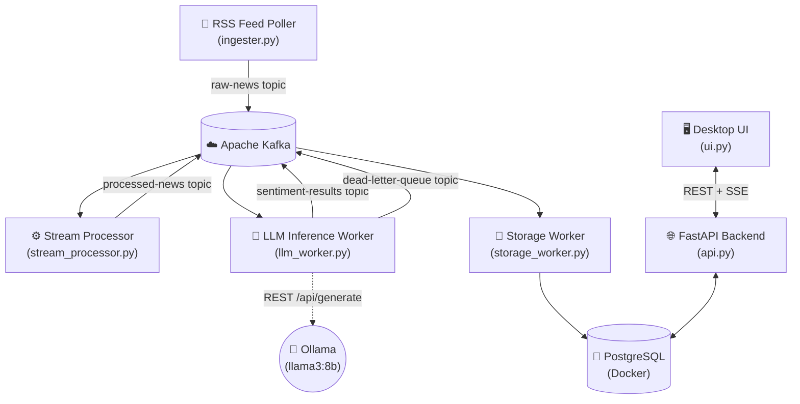

# 📡 Live News Intelligence Pipeline

A **fault-tolerant, event-driven, real-time financial news analysis pipeline** that monitors multiple company tickers live, enriches every news article with AI-powered sentiment analysis via a local LLM, and displays everything in a native dark-mode desktop dashboard.

---

## 🏗️ Architecture



---

## 📂 Project Structure

```
Live_News_Analysis_Intraday/
│
├── docker-compose.yml      # Zookeeper + Kafka + Postgres + Ollama
├── .env                    # Secrets & config (NOT committed to git)
├── .env.example            # Template for .env setup
├── sources.yaml            # ⚙️ Fully configurable news sources (edit freely)
├── requirements.txt        # Python dependencies
│
├── db_init.py              # DB schema creation + daily old-data clearance
├── ingester.py             # Async RSS reader → publishes to raw-news topic
├── stream_processor.py     # Text cleaning + forwarding to processed-news
├── llm_worker.py           # LLM inference with retries, DLQ, and CPU guard
├── storage_worker.py       # Persists Kafka events to PostgreSQL
├── api.py                  # FastAPI REST + SSE streaming backend
├── ui.py                   # CustomTkinter desktop dashboard
│
├── shutdown.ps1            # Safe shutdown: pg_dump → docker-compose down
└── backups/                # Timestamped .sql dumps (local only, gitignored)
```

---

## ⚡ Quick Start

### 1. Prerequisites
- [Docker Desktop](https://www.docker.com/products/docker-desktop/) running
- Python 3.10+
- [Ollama](https://ollama.com/) (can also run inside Docker — see `docker-compose.yml`)

### 2. Setup Environment

```powershell
# Copy the example env file and fill in your values
Copy-Item .env.example .env

# Install Python dependencies (ideally in a venv)
pip install -r requirements.txt
```

### 3. Start Infrastructure

```powershell
docker-compose up -d
```

### 4. Pull the LLM Model (first time only)

```powershell
docker exec -it ollama ollama pull llama3:8b
```

### 5. Initialize the Database

```powershell
python db_init.py
```

### 6. Run All Services (each in a separate terminal)

```powershell
# Terminal 1 – Ingester (reads RSS → Kafka)
python ingester.py

# Terminal 2 – Stream Processor
python stream_processor.py

# Terminal 3 – LLM Worker (sentiment analysis)
python llm_worker.py

# Terminal 4 – Storage Worker (Kafka → PostgreSQL)
python storage_worker.py

# Terminal 5 – API Backend
python api.py

# Terminal 6 – Desktop UI
python ui.py
```

### 7. Safe Shutdown (saves DB backup before stopping Docker)

```powershell
./shutdown.ps1
```

---

## ⚙️ Configuring News Sources

Edit `sources.yaml` to add, remove, or modify RSS feeds **without restarting any service** — the ingester reloads sources every polling cycle.

```yaml
sources:
  - name: GoogleNews_Apple
    url: "https://news.google.com/rss/search?q=Apple+stock"
    type: "rss"
    company_ticker: "AAPL"

  - name: GoogleNews_Tesla
    url: "https://news.google.com/rss/search?q=Tesla+TSLA"
    type: "rss"
    company_ticker: "TSLA"
```

You can also add/remove sources live from the desktop UI via the **⚙ Manage Sources** button.

---

## 🛡️ Fault Tolerance Design

| Layer | Strategy |
|---|---|
| **Ingester** | SHA-256 dedup; auto-reloads sources every cycle |
| **Kafka** | At-least-once delivery; config'd with replication |
| **LLM Worker** | Semaphore limits concurrency (default: 1); exponential backoff; DLQ after max retries |
| **Kafka Commits** | Manual offset commit — only after LLM succeeds |
| **DB Backup** | `shutdown.ps1` calls `pg_dump` before teardown |
| **Daily Clearance** | `db_init.py` deletes records from previous calendar days on startup |

---

## 🌱 Environment Variables (.env)

| Variable | Default | Description |
|---|---|---|
| `POSTGRES_USER` | `pipeline_user` | DB user |
| `POSTGRES_PASSWORD` | `pipeline_pass` | DB password |
| `POSTGRES_DB` | `news_pipeline` | DB name |
| `POSTGRES_HOST` | `localhost` | DB host |
| `KAFKA_BOOTSTRAP_SERVERS` | `localhost:9093` | Kafka broker |
| `OLLAMA_BASE_URL` | `http://localhost:11434` | Ollama endpoint |
| `LLM_MODEL` | `llama3:8b` | Model to use |
| `POLL_INTERVAL_SECONDS` | `60` | RSS polling interval |
| `LLM_CONCURRENCY_LIMIT` | `1` | Max simultaneous LLM calls |
| `LLM_TIMEOUT_SECONDS` | `60` | Ollama request timeout |
| `LLM_MAX_RETRIES` | `3` | Retries before DLQ |

---

## 📌 Kafka Topics

| Topic | Purpose |
|---|---|
| `raw-news` | Raw articles from RSS ingester |
| `processed-news` | Cleaned & normalized articles |
| `sentiment-results` | LLM sentiment output |
| `dead-letter-queue` | Failed messages after max retries |
