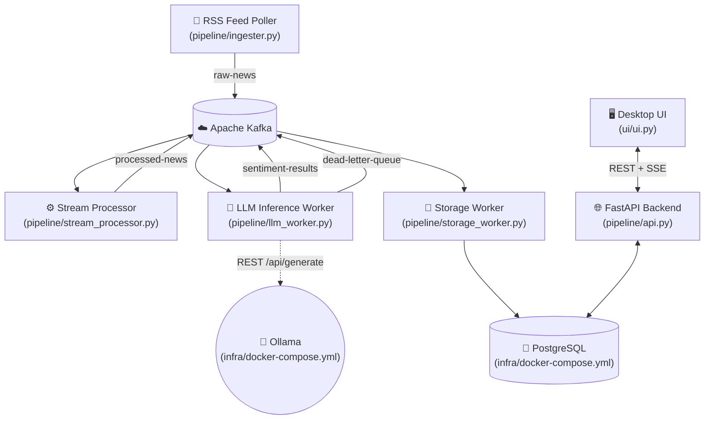

# 📡 Live News Intelligence Pipeline

A **fault-tolerant, event-driven, real-time financial news analysis pipeline** that monitors multiple company tickers live, enriches every article with AI-powered sentiment via a local LLM, and displays everything in a native dark-mode desktop dashboard.

---

## 🏗️ Architecture



---

## 📂 Project Structure

```
Live_News_Analysis_Intraday/
│
├── pipeline/                   # ⚙️ All Kafka pipeline services
│   ├── ingester.py             #   RSS poller → raw-news topic
│   ├── stream_processor.py     #   Cleaner → processed-news topic
│   ├── llm_worker.py           #   Ollama sentiment → sentiment-results topic
│   ├── storage_worker.py       #   Kafka → PostgreSQL
│   ├── api.py                  #   FastAPI REST + SSE backend
│   ├── sources.yaml            #   ⚙️ Configurable news sources (edit freely)
│   ├── requirements.txt        #   Worker dependencies
│   ├── requirements_api.txt    #   API dependencies
│   └── .env.example            #   Pipeline env template
│
├── ui/                         # 🖥️ Desktop dashboard
│   ├── ui.py                   #   CustomTkinter dark-mode dashboard
│   ├── requirements.txt
│   └── .env.example
│
├── database/                   # 🗄️ Schema & lifecycle management
│   ├── db_init.py              #   Schema creation + daily clearance
│   ├── requirements.txt
│   └── .env.example
│
├── infra/                      # 🐳 Docker infrastructure
│   ├── docker-compose.yml      #   Zookeeper + Kafka + Postgres + Ollama
│   └── shutdown.ps1            #   Safe shutdown with pg_dump backup
│
├── backups/                    # 💾 Timestamped DB dumps (gitignored)
├── .env.example                # Root global env template
├── .gitignore
└── README.md
```

---

## ⚙️ Configuring News Sources

Edit `pipeline/sources.yaml` — changes are picked up **automatically** on the next polling cycle, no restart needed. You can also manage sources live from the desktop UI's **⚙ Manage Sources** button.

```yaml
sources:
  - name: GoogleNews_Apple
    url: "https://news.google.com/rss/search?q=Apple+stock"
    type: "rss"
    company_ticker: "AAPL"
```

---

## ⚡ Quick Start

### 1. Prerequisites
- [Docker Desktop](https://www.docker.com/products/docker-desktop/) running
- Python 3.10+

### 2. Set Up Environment Files

```powershell
Copy-Item pipeline\.env.example pipeline\.env
Copy-Item database\.env.example database\.env
Copy-Item ui\.env.example        ui\.env
```

### 3. Install Dependencies

```powershell
pip install -r pipeline\requirements.txt
pip install -r pipeline\requirements_api.txt
pip install -r database\requirements.txt
pip install -r ui\requirements.txt
```

### 4. Start Docker Infrastructure

```powershell
docker-compose -f infra\docker-compose.yml up -d

# First time only — pull the LLM model
docker exec -it ollama ollama pull llama3.2:latest
```

### 5. Initialize Database

```powershell
python database\db_init.py
```

### 6. Run All Services (each in a separate terminal)

```powershell
python pipeline\ingester.py          # Terminal 1
python pipeline\stream_processor.py  # Terminal 2
python pipeline\llm_worker.py        # Terminal 3
python pipeline\storage_worker.py    # Terminal 4
python pipeline\api.py               # Terminal 5
python ui\ui.py                      # Terminal 6
```

### 7. Safe Shutdown

```powershell
# From project ROOT — creates timestamped DB backup before stopping Docker
.\infra\shutdown.ps1
```

---

## 🛡️ Fault Tolerance Design

| Layer | Strategy |
|---|---|
| **Ingester** | SHA-256 dedup; sources reload automatically every cycle |
| **Kafka** | At-least-once delivery; 4 partitioned topics |
| **LLM Worker** | Semaphore concurrency cap; exponential backoff; DLQ after max retries |
| **Kafka Commits** | Manual offset commit — only after LLM inference succeeds |
| **DB Backup** | `infra/shutdown.ps1` runs `pg_dump` before teardown |
| **Daily Clearance** | `database/db_init.py` wipes records from previous calendar days on startup |

---

## 📌 Kafka Topics

| Topic | Source | Consumer |
|---|---|---|
| `raw-news` | `ingester.py` | `stream_processor.py`, `storage_worker.py` |
| `processed-news` | `stream_processor.py` | `llm_worker.py` |
| `sentiment-results` | `llm_worker.py` | `storage_worker.py` |
| `dead-letter-queue` | `llm_worker.py` | *(manual review)* |

---

## ⚡ Recent Pipeline Enhancements
- **LLaMA 3.2 Migration**: Moved exclusively to the latest stable LLaMA 3.2 Ollama models. Prompt formatting was strictly locked into `{ "results": [{}] }` schema structures so large-batch inferences process flawlessly.
- **SSE Real-Time Sync**: Rewired the WebSocket (`api.py`) state cache to natively emit dynamically shifting inferences over a 1000-article limit. The dashboard now tracks LLM inferences in live real-time without data stagnation.
- **Dynamic UX State**: Overhauled the frontend macro-displays (`ui/index.html`) to proactively zero-out metrics depending strictly on active filter drop-downs. 
- **Code Hardening**: Python backend formally refactored and auto-formatted via `black`, completely resolving Mypy strict-typing defects regarding psycopg2 queries.
